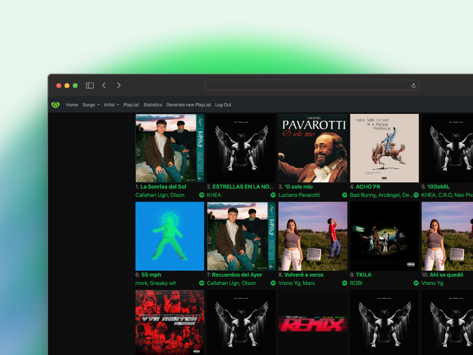

<h1 align="center">
  <br>
  <a href="https://musicnumbers-f4704.web.app/"></a>
  <br>
  Music Numbers
  <br>
</h1>

<h4 align="center">A website where you can follow your spotify activity</h4>


<p align="center">
  <a href="#key-features">Key Features</a> •
  <a href="#how-to-use">How To Use</a> •
  <a href="#credits">Credits</a> •
</p>



## Key Features

* See yours most played songs
* See yours favourite artists
* Check your most played genres
* A list with your recently listened to songs
* Check yours playlist


## How To Use

To clone and run this application, you'll need [Git](https://git-scm.com) and [Node.js](https://nodejs.org/en/download/) (which comes with [npm](http://npmjs.com)) installed on your computer. From your command line:

```bash
# Clone this repository
$ git clone https://github.com/pabloconejos/spotifyStats

# Install dependencies
$ npm install

# Get spotify keys
$ complete the envioraments with yours keys
$ call the environment in callback.component on the lines 39, 40, 41

# Run the app
$ ng serve
```
In this website https://developer.spotify.com/ you can create an app for get the keys. Is 100% spotify official website.


## Credits

This software uses the following open source packages:

- [Angular](https://angular.io/)
- [Bootstrap](https://getbootstrap.com/)
- [Spotify](https://developer.spotify.com/)

## Related

[musicnumbers-f4704.web](https://musicnumbers-f4704.web.app/) - Web version of Music Numbers

---

> GitHub [@pabloconejos](https://github.com/pabloconejos) &nbsp;&middot;&nbsp;
> Twitter [@konezk_](https://twitter.com/konezk_)
> Instagram [@alivezk_](https://www.instagram.com/alivezk_/)
> Linkedin [Pablo Conejos](www.linkedin.com/in/pablo-conejos-chirivella-145024252)


